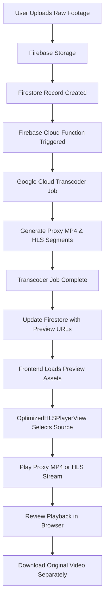
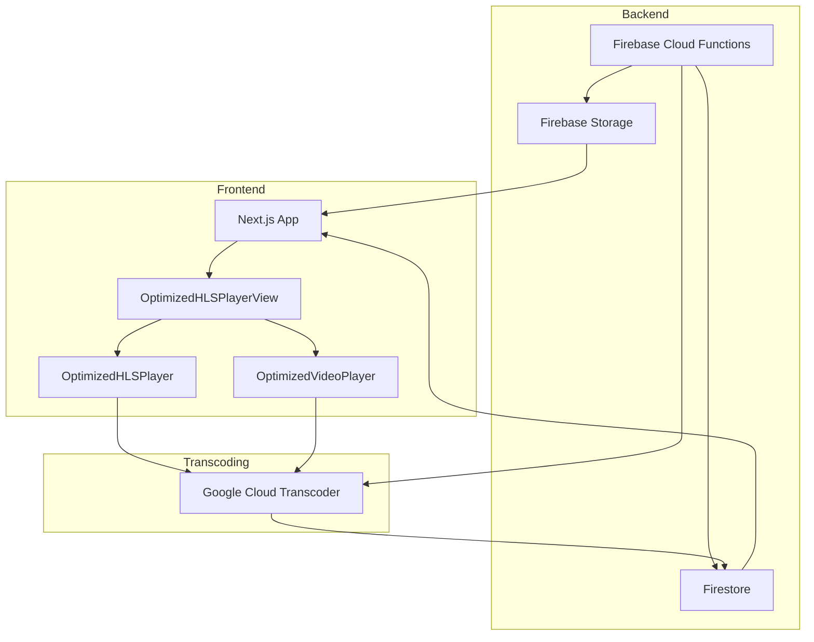

# EditoHub

## Overview

EditoHub is a premium video editing agency platform built with **Next.js 16.1.3**, **React 19.2.3**, **TypeScript**, **Tailwind CSS v4**, and **Framer Motion**. The app is designed to provide an agency-grade workflow for uploading raw footage, generating review-ready preview assets, and delivering fast browser playback using a modern video engineering stack.

The main goal of this repository is to support professional video review workflows with:

- low-latency preview playback
- adaptive streaming using HLS
- proxy video generation for fast browser playback
- secure review sharing and timestamped comments
- original video download delivery separate from review playback

## Tech Stack

- **Frontend**: Next.js 16.1.3, React 19.2.3, TypeScript, Tailwind CSS v4, Framer Motion
- **Video playback**: `hls.js`, custom `OptimizedHLSPlayer`, `OptimizedVideoPlayer`, `OptimizedHLSPlayerView`
- **Backend**: Firebase Cloud Functions, Firestore, Firebase Storage
- **Transcoding**: Google Cloud Transcoder, HLS segment generation, proxy MP4 creation
- **Hosting / deployment**: Vercel or Firebase Hosting for frontend, Firebase Functions for backend

## How the Technologies Work Together

1. **User uploads raw footage** from the browser into **Firebase Storage**.
2. The upload is recorded in **Firestore** and triggers a **Firebase Cloud Function**.
3. The Cloud Function sends the raw source to **Google Cloud Transcoder** to generate:
   - low-bitrate **proxy MP4** review assets
   - **HLS segmented streams** for adaptive playback
4. When transcoding completes, another Cloud Function updates Firestore with generated preview URLs.
5. The frontend review pages load the preview source from Firestore and render it using:
   - `OptimizedHLSPlayerView` to choose `proxyUrl` or `hlsUrl`
   - `OptimizedHLSPlayer` for adaptive streaming with `hls.js`
   - `OptimizedVideoPlayer` for direct MP4 playback when needed
6. Reviewers play back the proxy/HLS assets in the browser, while the high-quality original remains available only for download.

## Workflow Diagrams

### Video Processing Flow Diagram



### Video Engineering Architecture Diagram



## Video Engineering Architecture

### 1. Raw footage upload and ingestion

Raw video uploads are handled through Firebase Storage and Firestore. The platform stores the original video file as a high-quality source while also creating a processed review version that is optimized for playback.

### 2. Backend pipeline

The backend uses Firebase Cloud Functions to orchestrate the video processing workflow:

- `onRevisionCreated` / raw upload triggers: generate thumbnails and queue HLS transcoding.
- `onRawFootageUploaded`: processes finalized raw footage uploads, generates HLS segments, and creates low-bandwidth review-ready assets.
- `onTranscoderJobComplete`: listens for Google Cloud Transcoder completion events and updates Firestore metadata with generated preview URLs.

### 3. Preview generation

The review playback experience uses a dual-path system:

- **HLS adaptive streaming** for segmented playback and low buffering.
- **Proxy MP4** as a low-quality fallback for the fastest startup on large files.

This enables the platform to avoid loading the original raw Firebase video directly in the browser, which would otherwise cause heavy buffering and slow response.

### 4. Review vs download separation

The system preserves a strict separation between preview playback and downloads:

- Preview playback uses **optimized review assets** only.
- Download actions continue to use the **original high-quality `videoUrl`**.

This ensures clients can instantly review footage without sacrificing final delivery quality.

## Component Workflow

### `OptimizedHLSPlayerView`

This component chooses the best available preview source in this order:

1. `proxyUrl` (low-quality MP4)
2. `hlsUrl` (adaptive segmented stream)
3. fallback state with a waiting message if the preview is not ready

### `OptimizedHLSPlayer`

This player uses `hls.js` and custom buffer optimization logic:

- starts at the lowest quality level for fastest startup
- adapts quality progressively based on network and buffer state
- applies small buffer targets for review playback
- uses caching hooks and segment-level optimizations

### `OptimizedVideoPlayer`

This player handles direct MP4 preview playback with:

- custom controls
- play/pause
- volume adjustment
- fullscreen support
- seeking
- optional minimized UI for a cleaner review experience

## Key Features

- **Fast review playback** using proxy and HLS review assets
- **Progressive quality upgrades** for improved user experience
- **Secure shareable review links** for guest commenting
- **Timestamped timeline comments** anchored to exact video frames
- **Video preview generation pipeline** via Firebase Functions
- **Separation of preview and download delivery** for quality control

## Local Setup

```bash
cd editohub
npm install
npm run dev
```

Open `http://localhost:3000` in your browser to view the app.

## Deployment

This project is ready for deployment to platforms such as **Vercel** or **Firebase Hosting**. The video processing logic relies on Firebase Functions and Google Cloud services, so make sure the corresponding backend environment is configured.

## Repository Structure

- `src/app`: Next.js App Router routes, pages, and server/client components
- `src/components`: UI and video playback components
- `src/lib`: utility functions, streaming helpers, and HLS config
- `functions`: Firebase Cloud Functions for video processing and transcoding orchestration

## Notes

- The codebase is designed for a production-grade review workflow where preview performance is prioritized over raw file playback.
- The low-quality proxy and HLS assets are intended solely for review; downloads should always retrieve the original source file.
- If the preview is not ready, the interface will show a waiting state until the backend generates the required assets.

## License

© 2026 EditoHub. All rights reserved.
